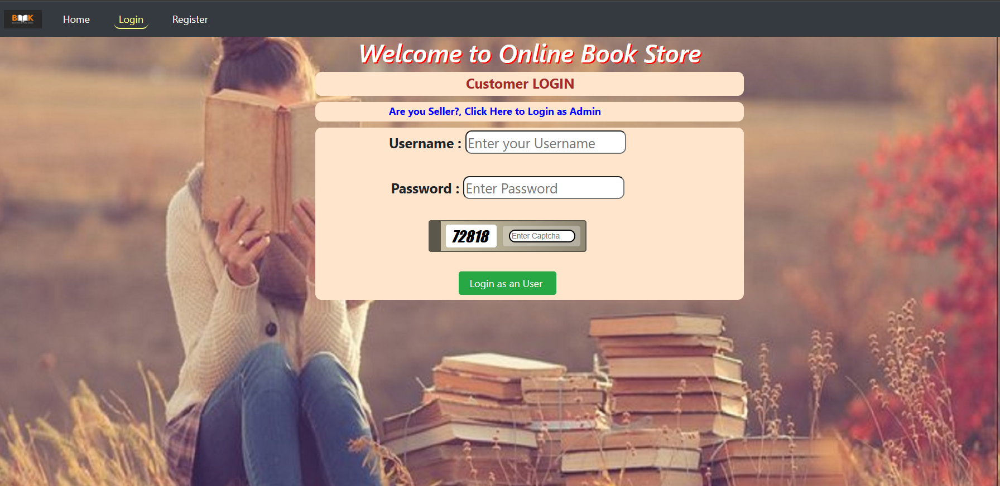
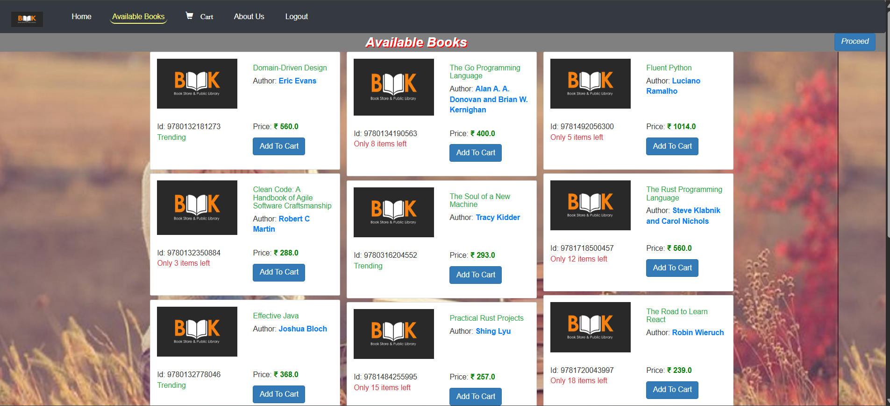

# Java OnlineBookStore Application Devops Implementation

### About

- A user-friendly Online Bookstore project in which users can log in or register, view the available books, select books along with their quantity, and buy them. Users can also get payment receipts after successful payment. The project can also be used by the administrator, who can add new books, remove books, increase and decrease the quantity of books, change the price of the books as well as maintain the selling history of books.
---

 | 

---

### Technologies used:-
1. Front-End Development:
- HTML
- CSS
- Javascript
- BootStrap

2. Back-End Development:
- Java [JDK 8+]
- JDBC
- Servlet

3. Database:
- MySql
---
## CONTAINERISATION:
- Clone repository 
```bash
    git clone https://github.com/sidraut007/JAVA-BookStoreApp-3-Tier.git
    cd JAVA-BookStoreApp-3-Tier
```

- Build docker image using dockerfile 
```bash
    docker build -t sidraut007/book-app .
``` 

- HOW RUN AND ACCESS APPLICATION:
```bash
    docker compose up -d
```

- Now You can access your application on http://localhost:8080/onlinebookstore/